# Bill of Materials (BOM)

**ByByte Nano** — main board (`Board1_main`)

Full component list for robot assembly. Tables are grouped by part type.

---

## PCB, power & protection

| # | Designator | Qty | Description | Value / model | Image |
|:--:|------------|:-----:|-------------|---------------|:-----:|
| 1 | `BAT1` | 1 | Battery holder | BH9VPC | 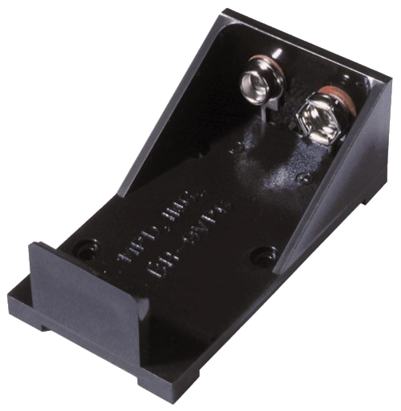 |
| 2 | `Li-ion Battery` | 1 | 9V Li-ion rechargeable battery (PP3 / “Krona” form factor) | BAT-6F22 | 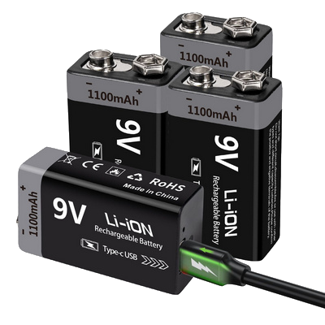 |
| 3 | `C1,C4,C17` | 2 | Electrolytic capacitor, low ESR | 470uF 16v | 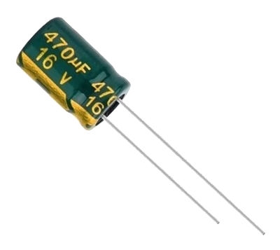 |
| 4 | `C3,C5` | 3 | Electrolytic capacitor, low ESR | 470uF 6.3v | 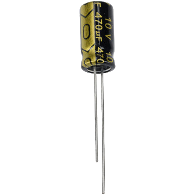 |
| 5 | `D4` | 1 | Schottky diode | 1N5822 | 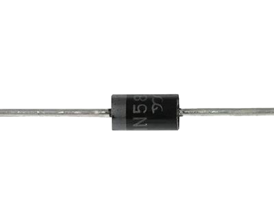 |
| 6 | `D5` | 1 | Schottky diode | 1N5817 | 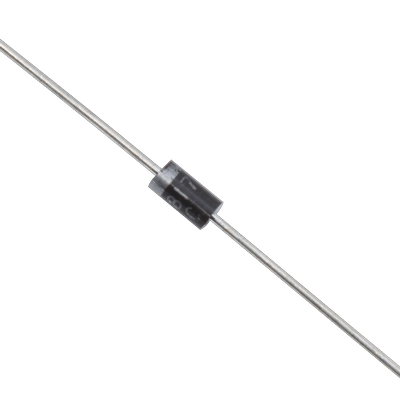 |
| 7 | `F1` | 1 | Fuse (optional) | TRF250-1000 (optional) | 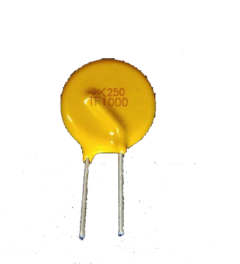 |
| 8 | `L1,L2` | 2 | Leaded EMI ferrite bead | R6H-3.0T | 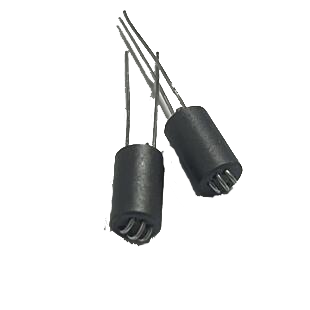 |
| 9 | `U3,U4` | 2 | DC-DC buck module | MH-MINI-361 (or HW-613) | 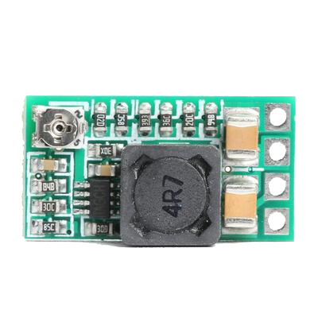 |
| 10 | `pcb` | 1 | Main ByByte nano board | PCB |  |

## Passive components

| # | Designator | Qty | Description | Value / model | Image |
|:--:|------------|:-----:|-------------|---------------|:-----:|
| 11 | `C2,C6,C7,C9,C11,C12,C13,C14,C18` | 9 | Ceramic capacitor | 1uF 50v |  |
| 12 | `C8,C10,C19` | 3 | Ceramic capacitor | 0.1uF 50v |  |
| 13 | `C15,C16` | 2 | Ceramic capacitor | 10nF 50v | 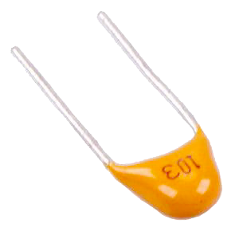 |
| 14 | `R1,R2` | 2 | 1/8 W resistor | 1kΩ | 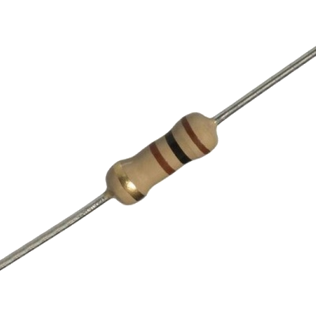 |
| 15 | `R3,R6,R9,R10,R14` | 5 | 1/8 W resistor | 10kΩ | 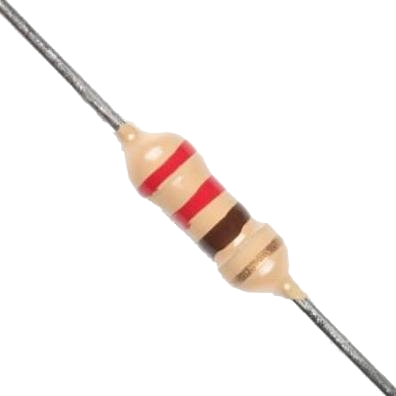 |
| 16 | `R4,R5` | 2 | 1/4 W resistor | 39Ω | 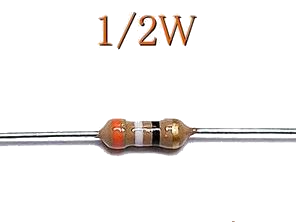 |
| 17 | `R7,R8` | 2 | 1/8 W resistor | 1.8kΩ |  |
| 18 | `R11,R12` | 2 | 1/8 W resistor | 100kΩ | 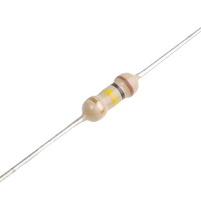 |
| 19 | `R13` | 1 | 1/8 W resistor | 330Ω |  |
| 20 | `R15` | 1 | 1/8 W resistor | 100Ω | 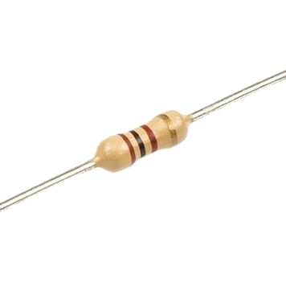 |

## Semiconductors & diodes

| # | Designator | Qty | Description | Value / model | Image |
|:--:|------------|:-----:|-------------|---------------|:-----:|
| 21 | `D1,D2` | 2 | IR LED | SFH4545 |  |
| 22 | `D3` | 1 | Diode | 1N4148 |  |
| 23 | `LED1` | 1 | Green LED 3 mm | FYL-3004GD | 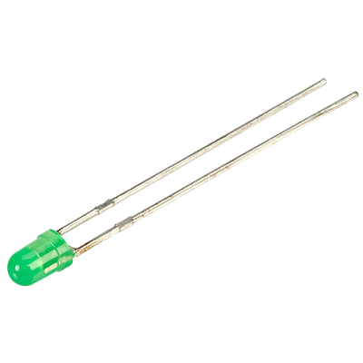 |
| 24 | `LED2,LED3` | 2 | 5 mm addressable RGB LED (WS2812) | WS2812B-TH | 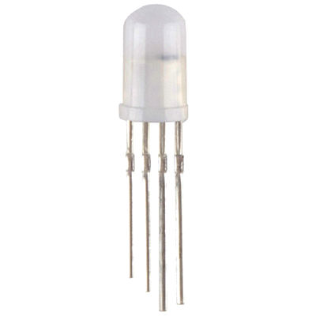 |
| 25 | `Q1` | 1 | NPN transistor | 9014-C | 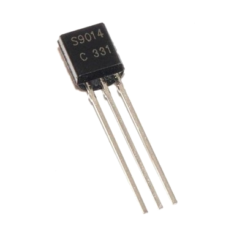 |
| 26 | `Q2,Q3` | 2 | IR phototransistor | TEFT4300 | 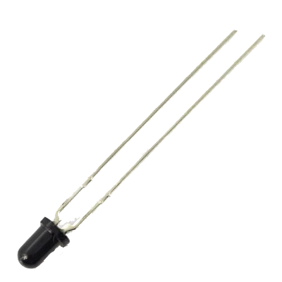 |
| 27 | `Q4` | 1 | HEXFET / MOSFET transistor | BS170 |  |
| 28 | `U9` | 1 | Operational amplifier | LM358AP | 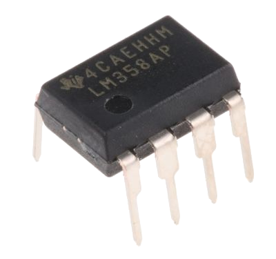 |
| 29 | `U9` | 1 | DIP-8 IC socket | GOLD-8P | 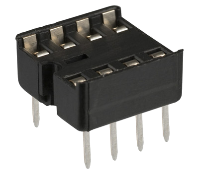 |

## Modules & controllers

| # | Designator | Qty | Description | Value / model | Image |
|:--:|------------|:-----:|-------------|---------------|:-----:|
| 30 | `BLUETOOTH1` | 1 | Bluetooth module (HC-02 / HC-05 / HC-06) | HC-06 | 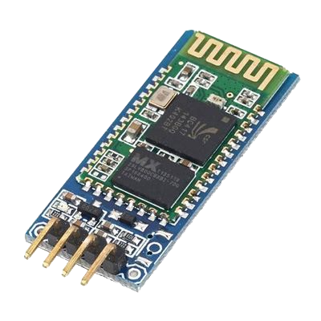 |
| 31 | `BUZZER1` | 1 | Passive buzzer 5V | buzzer-12X9 | 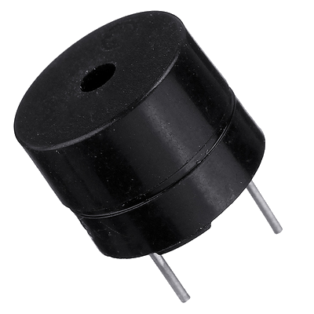 |
| 32 | `LDR1` | 1 | Photo-resistor (LDR) | 10k | 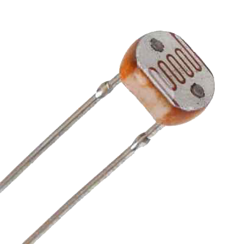 |
| 33 | `U1` | 1 | Arduino Nano (ATmega328) | Arduino nano v3 (old) |  |
| 34 | `U2` | 1 | Motor driver module | DRV8833 | 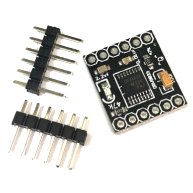 |
| 35 | `U5` | 1 | Ultrasonic distance sensor | HC-SR04 |  |
| 36 | `U6` | 1 | Line tracker module (5 channels) | TRCT5000 5way module | 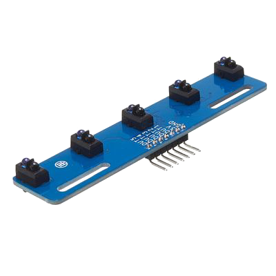 |
| 37 | `U7` | 1 | IR receiver IC | VS1838B | 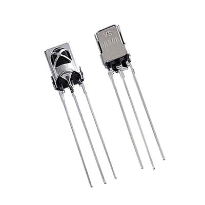 |
| 38 | `U8` | 1 | ESP32-CAM module with 120° camera | ESP32-CAM |  |

## Connectors, switches & buttons

| # | Designator | Qty | Description | Value / model | Image |
|:--:|------------|:-----:|-------------|---------------|:-----:|
| 39 | `H1,H2,H5,H6,J1,J2,J3` | 1 | 1×40 pin header, 2.54 mm pitch | ZL201-40G |  |
| 40 | `H3,H4` | 2 | 2×1 female header, 2.54 mm, 90° | ZL263-2SG | 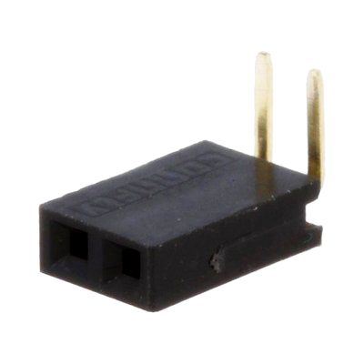 |
| 41 | `XP3,XP4` | 1 | 1×40 pin header, 2.54 mm pitch, 90° | ZL211-40KG-S |  |
| 42 | `KEY1,KEY2` | 2 | 6 mm tactile button, 4 pins | 1301.9301 | 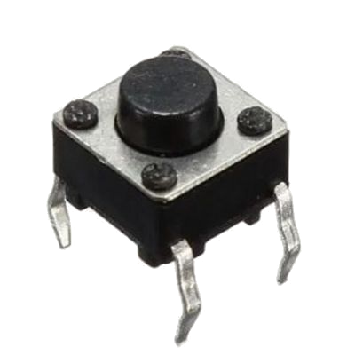 |
| 43 | `SW1` | 1 | Slider switch, 90° | SS-12D | 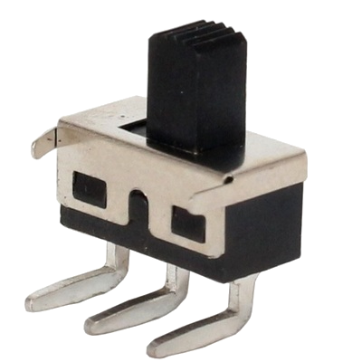 |
| 44 | `U1 holder` | 2 | 1×15 female header, 2.54 mm (for Nano) | PBS-15 |  |
| 45 | `U8 holder` | 2 | 1×8 female header, 2.54 mm (for ESP32-CAM) | ZL262-8SG | 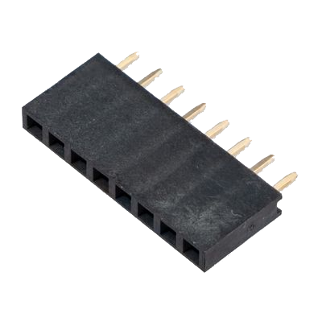 |
| 46 | `U6 holder` | 1 | 1×7 female header, 2.54 mm (for line trackers) | PBS-07R |  |
| 47 | `U2 holder` | 2 | 1×6 female header, 2.54 mm | PBS-06 | 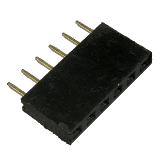 |

## Mechanics & drive

| # | Designator | Qty | Description | Value / model | Image |
|:--:|------------|:-----:|-------------|---------------|:-----:|
| 48 | `M1,M2` | 2 | DC geared motor N20, 6V | N20 motor 500-1000 rpm | 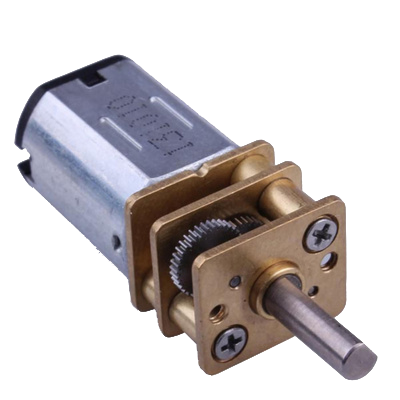 |
| 49 | `Mount,Mount1` | 2 | N20 ABS motor mount with screw | N20 mount | 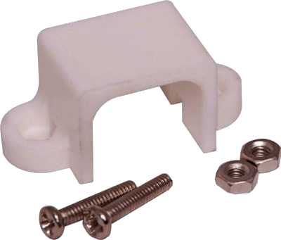 |
| 50 | `Ball wheel` | 2 | N20 mini caster / ball wheel | Ball wheel mini | 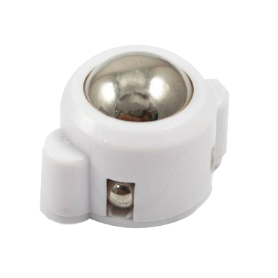 |
| 51 | `Wheel` | 2 | N20 wheel, 44 mm, 3 mm shaft | N20 44mm | 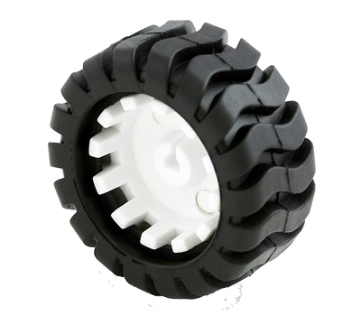 |
| 52 | `M2 x 8mm screw` | 3 | M2 screw 8mm length | M2x8mm | 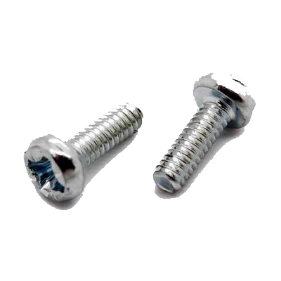 |
| 53 | `M3 x 12mm screw` | 4 | M3 screw 12mm length | M3x12mm | 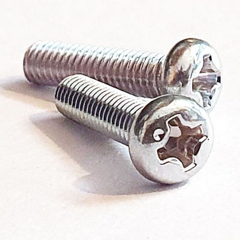 |
| 54 | `HTP-320` | 2 | Plastic standoff 20mm M3 double-sided | HTP-320 | 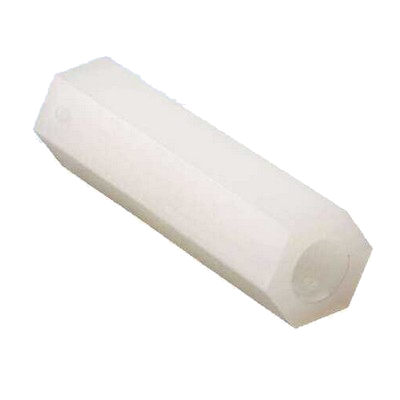 |
| 55 | `HTP-305` | 2 | Plastic standoff 5mm M3 double-sided | HTP-305 | 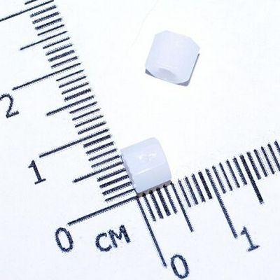 |
| 56 | `M3 DIN 985` | 2 | M3 self-locking nut | M3 DIN985 | 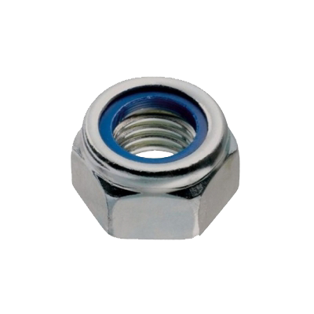 |
| 57 | `M2 DIN 985` | 3 | M2 self-locking nut | M2 DIN985 | 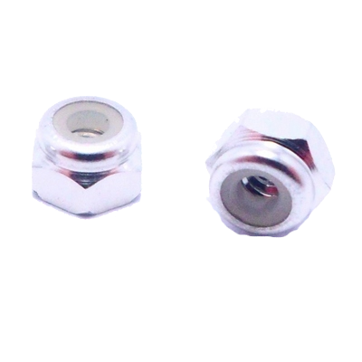 |

## Consumables

Materials used during assembly; not included in the robot BOM line count above.

| # | Qty | Description | Notes | Image |
|:--:|:-----:|-------------|-------|-------|
| 1 | 1 | Solder wire, 0.8–1.0 mm | Sn60/Pb40 (Cynel recommended); for through-hole components and headers | 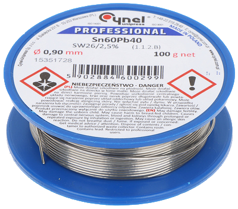 |
| 2 | 1 | Flux paste or rosin flux | (Optional) makes soldering easier on pads and pin headers | 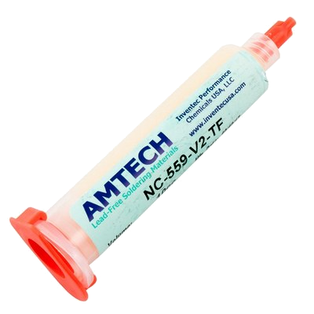 |
| 3 | 1 | Isopropyl alcohol (IPA), 99% | (Optional) flux residue cleaning after soldering | 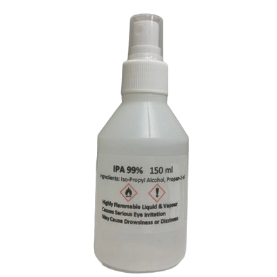 |
| 4 | 1 | Heat shrink tubing 8mm diameter **BLACK!** | for isolating IR LEDs | 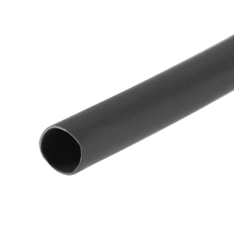 |

## Required tools

| # | Tool | Purpose | Image |
|:--:|------|---------|-------|
| 1 | Soldering iron (25–60 W, temperature-controlled) | Soldering passives, semiconductors, connectors, and modules | 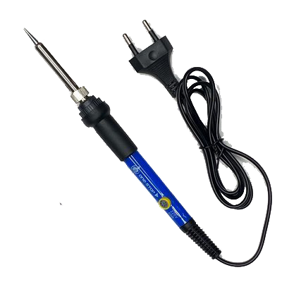 |
| 2 | Side / flush cutters | Trimming component leads; cutting pin headers to length | 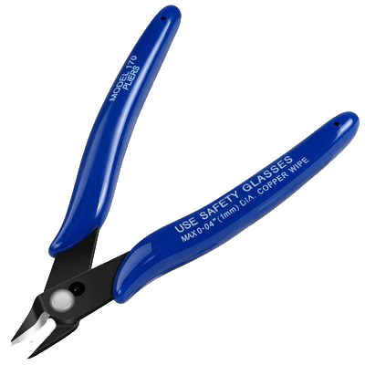 |
| 3 | Multimeter | Setting DC-DC outputs to 5 V and 3.3 V; polarity and rail checks before first power-up | 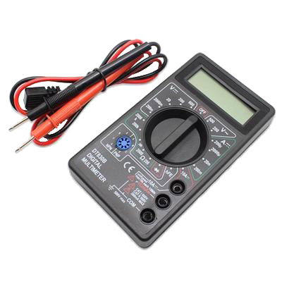 |
| 4 | Small Phillips screwdriver | M2/M3 assembly; adjusting DC-DC module trim pots | 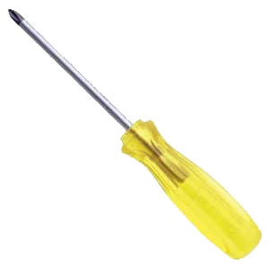 |
| 5 | USB cable (Mini-B or Micro-B or Type-C, per Nano revision) | Uploading firmware to Arduino Nano |  |
| 6 | PC with Arduino IDE | Programming and testing |  |

**Optional:** helping hands / PCB holder, magnifying lamp.

---

## Summary

| Parameter | Value |
|-----------|-------|
| Unique line items | 57 |
| Optional parts | F1 (fuse) |
| Bluetooth | HC-02 / HC-05 / HC-06 |
| DC-DC modules | MH-MINI-361 or HW-613 (recommended) |
| Controller | Arduino Nano v3 (ATmega328) |
