# Bill of Materials (BOM)

**ByByte Nano** — main board (`Board1_main`)

Full component list for robot assembly. Tables are grouped by part type.

<!--
Tip: the Image column on the right automatically picks up a file
when its name matches the value in the File column.
-->

---

## PCB, power & protection

| # | Designator | Qty | Description | Value / model | Image | File |
|:--:|------------|:-----:|-------------|---------------|:-----:|------|
| 1 | `BAT1` | 1 | Battery holder | BH9VPC | 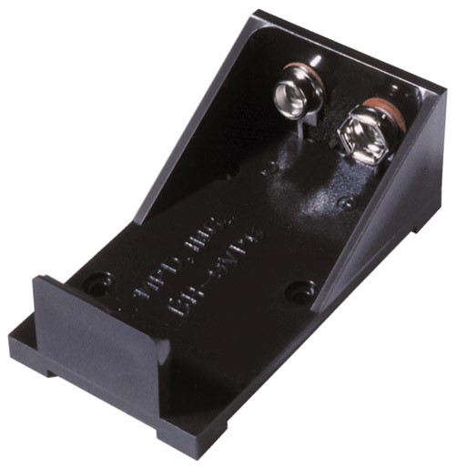 | `01_bat1.jpg` |
| 2 | `Li-ion Battery` | 1 | 9V Li-ion rechargeable battery (PP3 / “Krona” form factor) | BAT-6F22 | 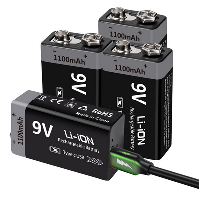 | `02_li-ion-battery.jpg` |
| 3 | `C1,C4` | 2 | Electrolytic capacitor, low ESR | 470uF 16v | 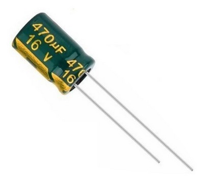 | `03_c1.jpg` |
| 4 | `C3,C5,C17` | 3 | Electrolytic capacitor, low ESR | 470uF 10v | 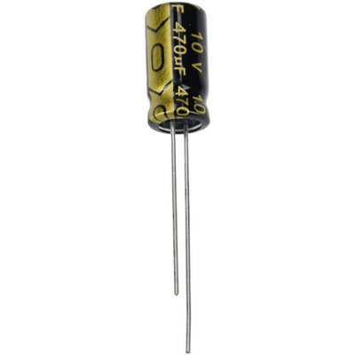 | `04_c3.jpg` |
| 5 | `D4` | 1 | Schottky diode | 1N5822 | 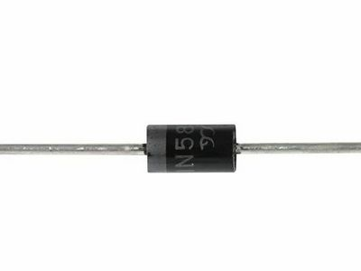 | `05_d4.jpg` |
| 6 | `F1` | 1 | Fuse (optional) | TRF250-1000 (optional) | 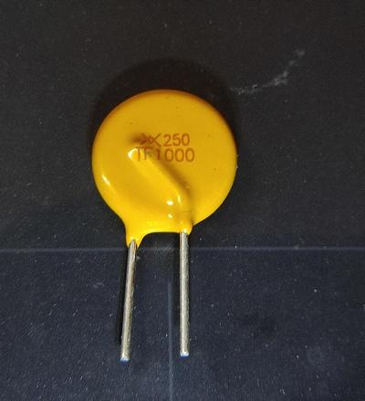 | `06_f1.jpg` |
| 7 | `L1,L2` | 2 | Leaded EMI ferrite bead | R6H-3.0T | 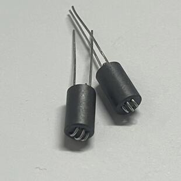 | `07_l1.jpg` |
| 8 | `U3,U4` | 2 | DC-DC buck module | MH-MINI-361 (or HW-613) | 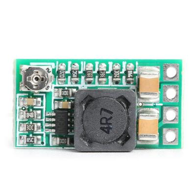 | `08_u3.jpg` |
| 9 | `pcb` | 1 | Main ByByte nano board | PCB | 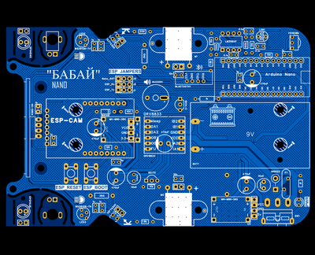 | `pcb.png` |

## Passive components

| # | Designator | Qty | Description | Value / model | Image | File |
|:--:|------------|:-----:|-------------|---------------|:-----:|------|
| 10 | `C2,C6,C7,C9,C11,C12,C13,C14,C18` | 9 | Ceramic capacitor | 1uF 50v | 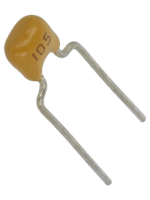 | `09_c2.png` |
| 11 | `C8,C10,C19` | 3 | Ceramic capacitor | 0.1uF 50v | 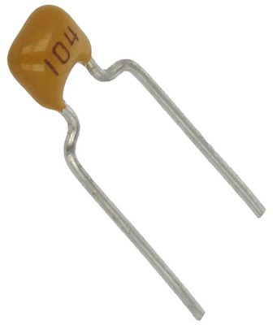 | `10_c8.png` |
| 12 | `C15,C16` | 2 | Ceramic capacitor | 10nF 50v | 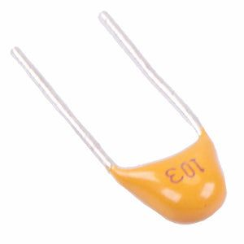 | `11_c15.jpg` |
| 13 | `R1,R2` | 2 | 1/8 W resistor | 1kΩ | 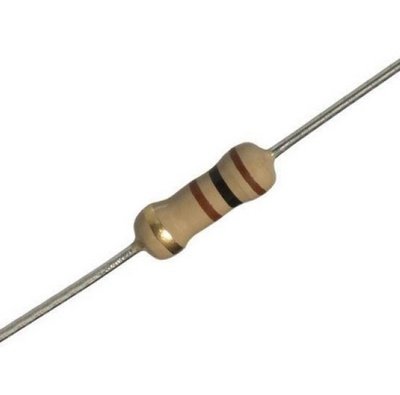 | `12_r1.jpg` |
| 14 | `R3,R6,R9,R10,R14` | 5 | 1/8 W resistor | 10kΩ | 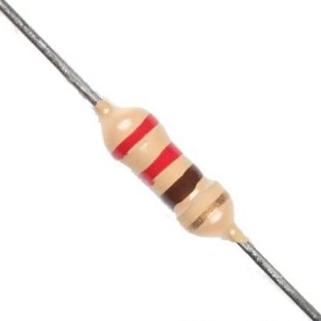 | `13_r3.jpg` |
| 15 | `R4,R5` | 2 | 1/2 W resistor | 39Ω | 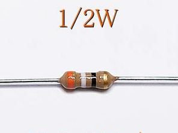 | `14_r4.jpg` |
| 16 | `R7,R8` | 2 | 1/8 W resistor | 1.8kΩ | 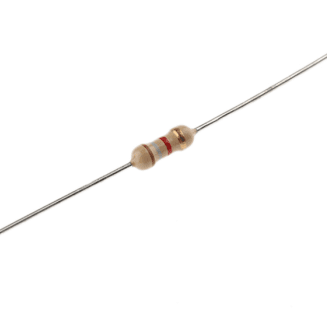 | `15_r7.png` |
| 17 | `R11,R12` | 2 | 1/8 W resistor | 100kΩ | 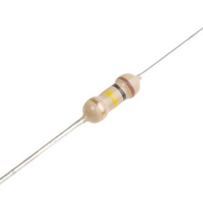 | `16_r11.jpg` |
| 18 | `R13` | 1 | 1/8 W resistor | 330Ω | 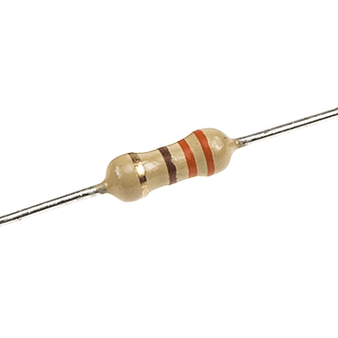 | `17_r13.png` |
| 19 | `R15` | 1 | 1/8 W resistor | 100Ω | 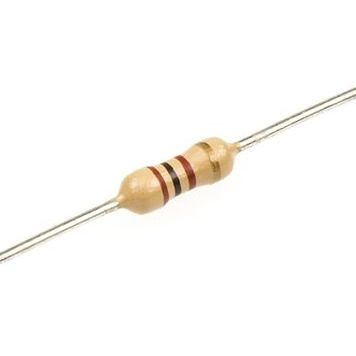 | `18_r15.jpg` |

## Semiconductors & diodes

| # | Designator | Qty | Description | Value / model | Image | File |
|:--:|------------|:-----:|-------------|---------------|:-----:|------|
| 20 | `D1,D2` | 2 | IR LED | SFH4545 | 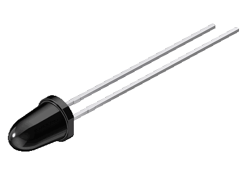 | `19_d1.png` |
| 21 | `D3` | 1 | Diode | 1N4149 | 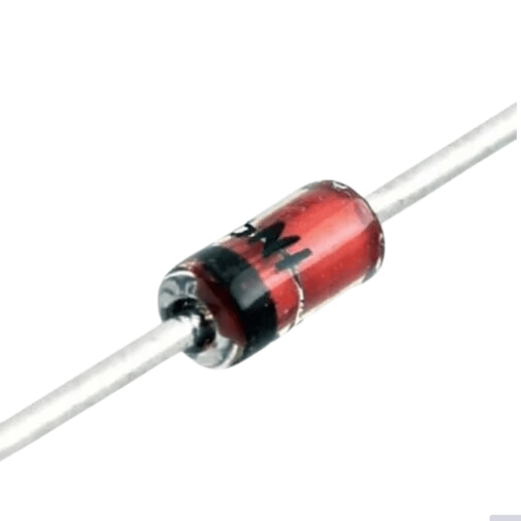 | `20_d3.png` |
| 22 | `LED1` | 1 | Green LED 3 mm | FYL-3004GD | 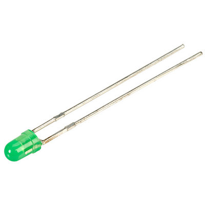 | `21_led1.jpg` |
| 23 | `LED2,LED3` | 2 | 5 mm addressable RGB LED (WS2812) | WS2812B-TH | 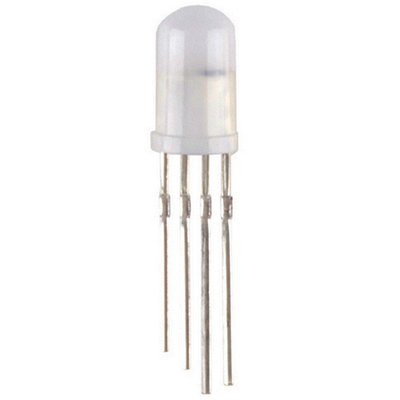 | `22_led2.jpg` |
| 24 | `Q1` | 1 | NPN transistor | 9014-C | 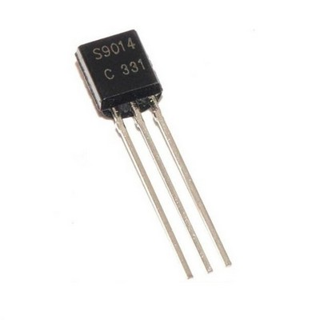 | `23_q1.jpg` |
| 25 | `Q2,Q3` | 2 | IR phototransistor | TEFT4300 | 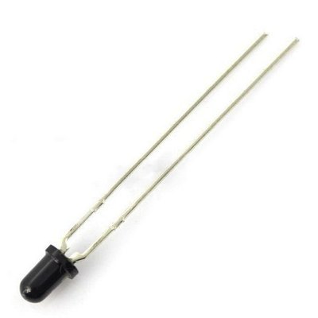 | `24_q2.jpg` |
| 26 | `Q4` | 1 | HEXFET / MOSFET transistor | BS170 | 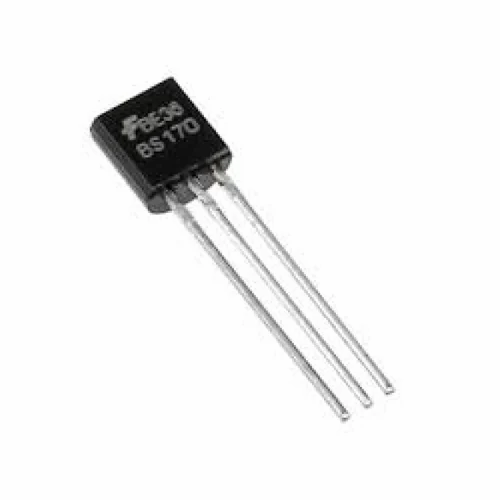 | `25_q4.png` |
| 27 | `U9` | 1 | Operational amplifier | LM358AP | 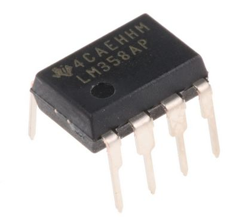 | `26_u9.jpg` |
| 28 | `U9` | 1 | DIP-8 IC socket | GOLD-8P | 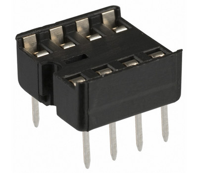 | `27_u9.jpg` |

## Modules & controllers

| # | Designator | Qty | Description | Value / model | Image | File |
|:--:|------------|:-----:|-------------|---------------|:-----:|------|
| 29 | `BLUETOOTH1` | 1 | Bluetooth module (HC-02 / HC-05 / HC-06) | HC-06 | 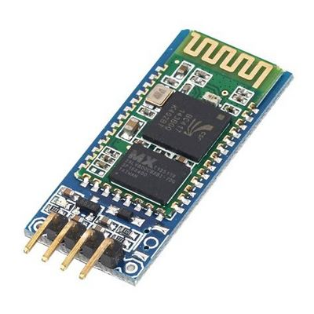 | `28_bluetooth1.jpg` |
| 30 | `BUZZER1` | 1 | Passive buzzer 5V | buzzer-12X9 | 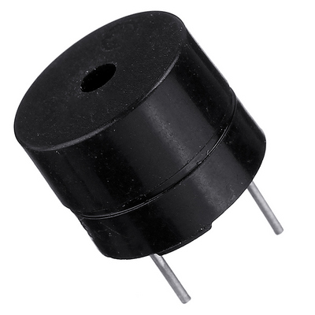 | `29_buzzer1.jpg` |
| 31 | `LDR1` | 1 | Photo-resistor (LDR) | 10k | 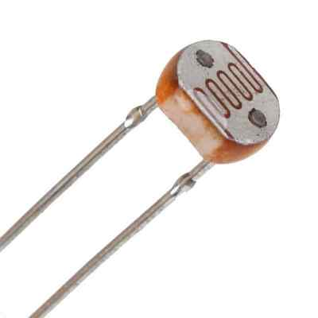 | `30_ldr1.jpg` |
| 32 | `U1` | 1 | Arduino Nano (ATmega328) | Arduino nano v3 (old) | 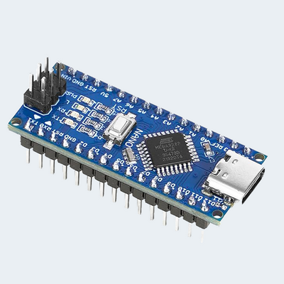 | `31_u1.png` |
| 33 | `U2` | 1 | Motor driver module | DRV8834 | 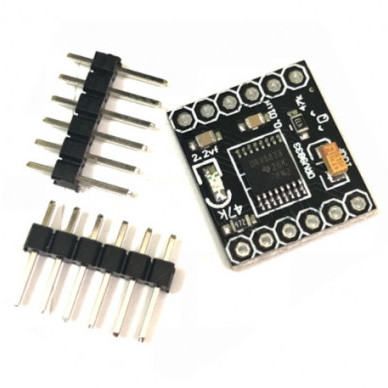 | `32_u2.jpg` |
| 34 | `U5` | 1 | Ultrasonic distance sensor | HC-SR05 | 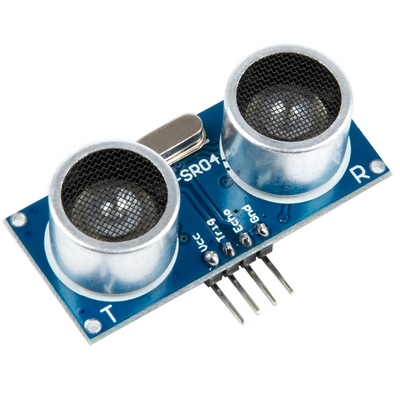 | `33_u5.png` |
| 35 | `U6` | 1 | Line tracker module (5 channels) | TRCT5000 5way module | 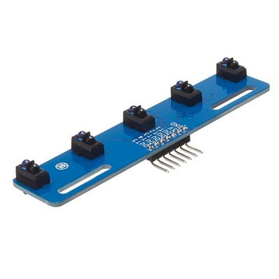 | `34_u6.jpg` |
| 36 | `U7` | 1 | IR receiver IC | VS1838B | 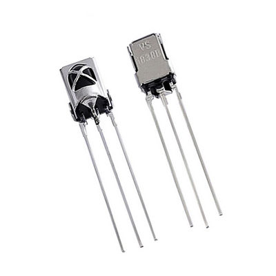 | `35_u7.jpg` |
| 37 | `U8` | 1 | ESP32-CAM module with 120° camera | ESP32-CAM | 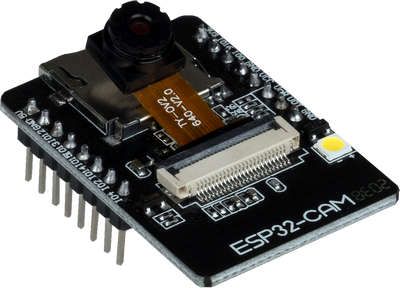 | `36_u8.png` |

## Connectors, switches & buttons

| # | Designator | Qty | Description | Value / model | Image | File |
|:--:|------------|:-----:|-------------|---------------|:-----:|------|
| 38 | `H1,H2, H5,H6,J1,J2,J3` | 1 | 1×40 pin header, 2.54 mm pitch | ZL201-40G | 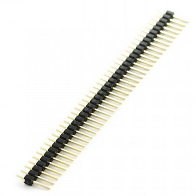 | `37_h1.jpg` |
| 39 | `H3,H4` | 2 | 2×1 female header, 2.54 mm, 90° | ZL263-2SG | 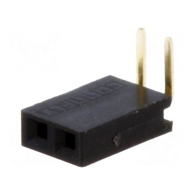 | `38_h3.jpg` |
| 40 | `XP3,XP4` | 1 | 1×40 pin header, 2.54 mm pitch, 90° | ZL211-40KG-S | 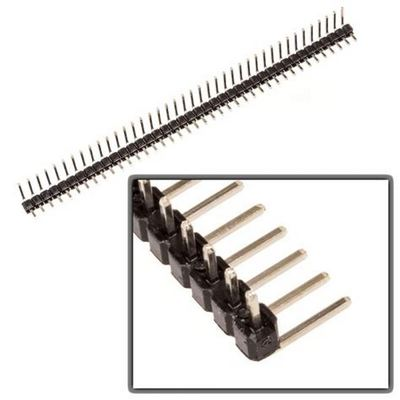 | `39_xp3.jpg` |
| 41 | `KEY1,KEY2` | 2 | 6 mm tactile button, 4 pins | 1301.9301 | 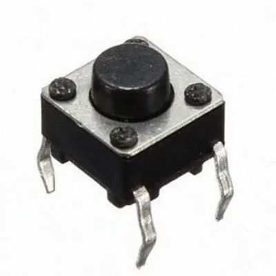 | `40_key1.jpg` |
| 42 | `SW1` | 1 | Slider switch, 90° | SS-12D | 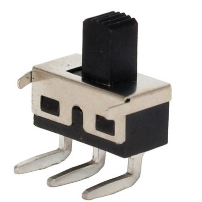 | `41_sw1.jpg` |
| 43 | `U1 holder` | 1 | 1×40 female header, 2.54 mm (for Nano) | ZL262-40SG | 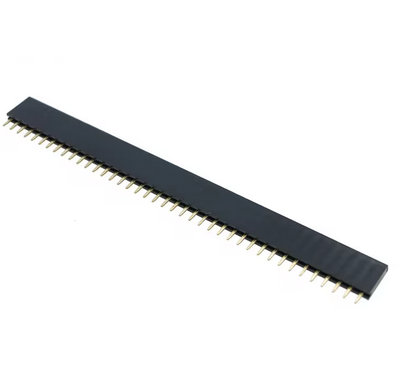 | `42_u1-holder.png` |
| 44 | `U8 holder` | 2 | 1×8 female header, 2.54 mm (for ESP32-CAM) | ZL262-8SG | 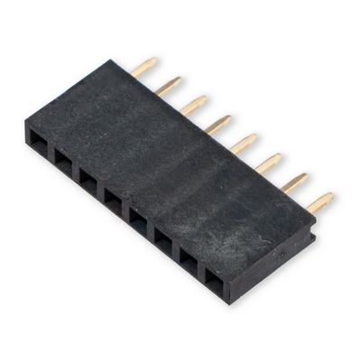 | `43_u8-holder.jpg` |
| 45 | `U6 holder` | 1 | 1×8 female header, 2.54 mm |  | 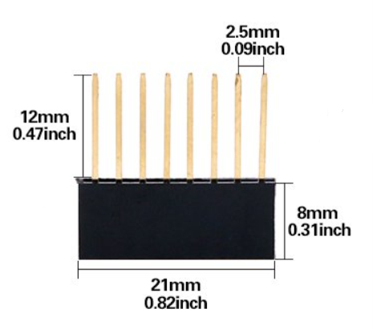 | `u6-holder.png` |

## Mechanics & drive

| # | Designator | Qty | Description | Value / model | Image | File |
|:--:|------------|:-----:|-------------|---------------|:-----:|------|
| 46 | `M1,M2` | 2 | DC geared motor N20, 6V | N20 motor 600-1000 rpm | 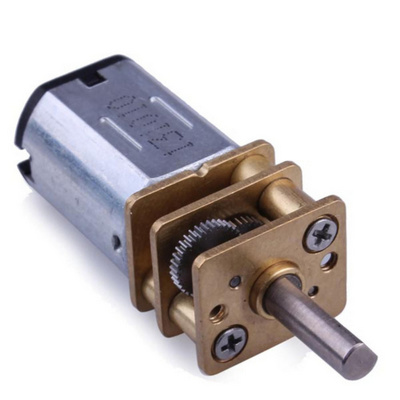 | `44_m1.jpg` |
| 47 | `Mount,Mount1` | 2 | N20 ABS motor mount with screw | N20 mount | 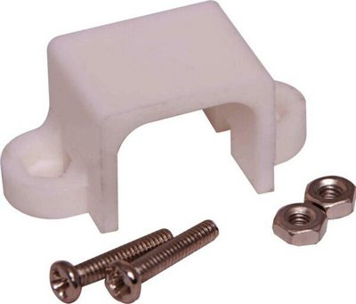 | `45_mount.jpg` |
| 48 | `Ball wheel` | 2 | N20 mini caster / ball wheel | Ball wheel mini | 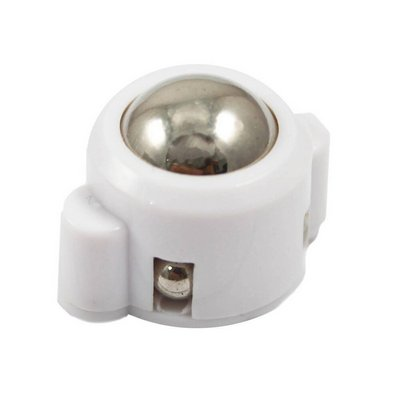 | `46_ball-wheel.jpg` |
| 49 | `Wheel` | 2 | N20 wheel, 44 mm, 3 mm shaft | N20 44mm | 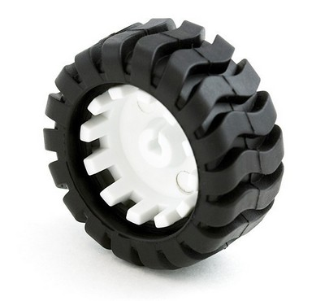 | `47_wheel.jpg` |

---

## Summary

| Parameter | Value |
|-----------|-------|
| Unique line items | 49 |
| Optional parts | F1 (fuse) |
| Bluetooth | HC-02 / HC-05 / HC-06 |
| DC-DC modules | MH-MINI-361 or HW-613 (recommended) |
| Controller | Arduino Nano v3 (ATmega328) |
