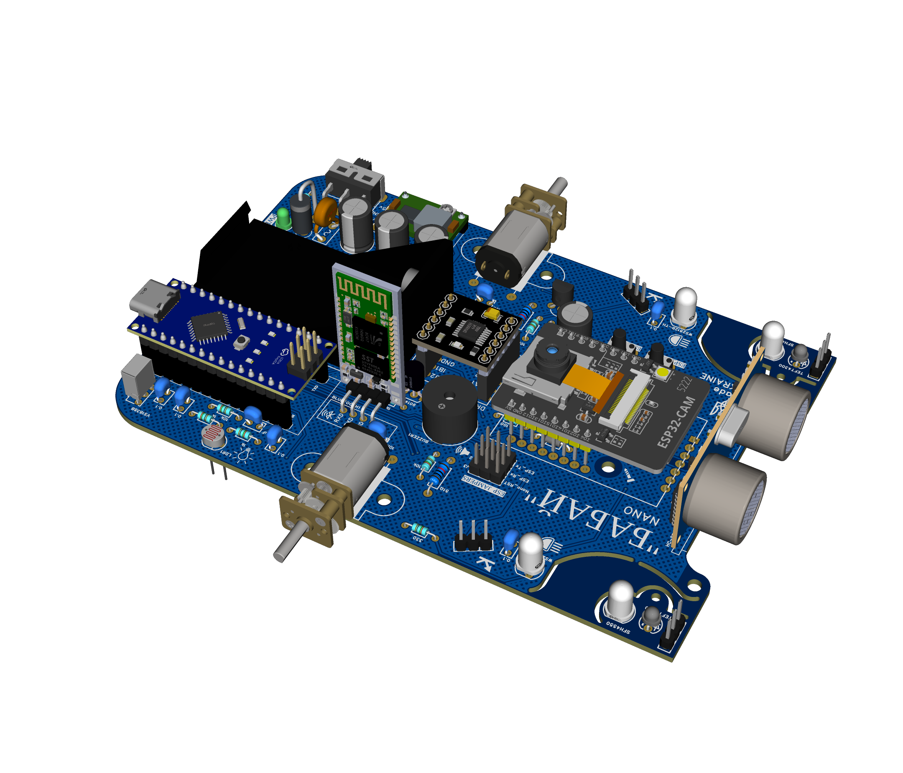

## "БАБАЙ" (ByByte) Nano — Освітня робототехнічна платформа

**БАБАЙ Nano** — це компактна та зручна для початківців навчальна робототехнічна платформа з лінійки ByByte. Вона створена для швидкого складання, безпечного використання у навчальних аудиторіях та наочного вивчення основ робототехніки: електроніки, сенсорів, керування двигунами та вбудованого програмування. Порівняно з більш просунутою ByByte Mega, версія Nano робить акцент на простоті та доступності, зберігаючи можливість розширення.

- Суміжний проєкт: ознайомтесь з більш функціональною версією — ByByte Mega ([README ByByte Mega](https://github.com/ByByte-diy/ByByteMega/blob/main/README.md)).

### Основні можливості
- Дружня до новачків: просте складання та зрозуміле розміщення елементів
- Компактна плата: оптимальні габарити для класних занять і воркшопів
- Модульність: роз’єми для підключення розширень та сенсорів
- Відкрита апаратна частина: наявні схема та файли плати
- Відкрите ПЗ: сумісність зі звичними Arduino‑інструментами

### Огляд апаратної частини
- Основна плата: ByByte Nano PCB
- Мікроконтролер: сумісний з Arduino, у форм‑факторі Nano
- Типові периферії: драйвери двигунів, датчики лінії, світлодіоди, стабілізація живлення
- Роз’єми: чітко промарковані входи/виходи та живлення для швидкого прототипування

Перегляд повної принципової схеми:
- `hardware/schematics/ByByte_main_schematic.pdf`

Попередній вигляд плати:
- Верх: `cad/img/2D_PCB_top.png`
- Низ: `cad/img/2D_PCB_bottom.png`

### Технічні характеристики (загальні)
- **Живлення**: Батарея (Аккумулятор) типу "Крона" 9в
- **CPU**: Основна плата Arduino Nano (atmega328)
- **Привід**: Мотори (N20) формату мікро з редуктором, частота обертання 600-1000rpm
- **Зв'язок**: USB підключення (Arduino nano), Bluetooth (HC-02, HC-05, HC-06 ...), WIFI через ESP32-CAM (опціонально)
-  

### Датчики та інтерфейси
- **5 датчиків лінії**: Для руху робота по лінії
- **Бічні оптичні датчики**: Аналогові датчики для руху по лабіринту або обхід перешкод.
- **Датчик відстані спереду**: Ультразвуковий датчик для вимірювання відстані попереду.
- **Аналоговий датчик світла**: Виявляє інтенсивність навколишнього освітлення.
- **ІЧ приймач**: Для прийому сигналів від ІЧ пульта керування.
- **Bluetooth**: Є можливість приєднуватись та керувати роботом зі смартфону або ПК.
- **2 RGB WS2812**: RGB керовані світлодіоди у вигляді фар.
- **Бузер пасивний**: Звукове супроводження робота.

### Інша периферія
  Є можливість встановити додатковий модуль ESP32-CAM який додасть можливість передачі відео з робота мережею WIFI. ESP модуль можна програмувати з самого робота, для цього треба відповідно до схеми встановити перемички J1 - J3. Також можна налаштувати комунікацію ESP модуля з основною платою Arduino nano та керувати роботом через мережу WIFI.

### Мобільність
Робот має два бічних колеса, що забезпечують диференціальне керування в стилі танка для точного контролю руху.

### Сумісність
Робот повністю сумісний з Arduino IDE та підтримує широкий спектр бібліотек Arduino. Це забезпечує простоту використання та доступність як для початківців, так і для досвідчених користувачів.

### Освітній фокус
Ця платформа розроблена для допомоги школярам та студентам розвивати основні навички програмування через роботу з практичними робототехнічними проектами. Вона надає можливості:
- Вивчати інтеграцію датчиків та обробку даних.
- Програмувати алгоритми руху для уникнення перешкод, слідування по лінії та навігації в лабіринтах.
- Використовувати візуальний та аудіальний зворотний зв'язок для підвищення інтерактивності.
- Ознайомитись з основами побудови робоплатформ на базі контролерів та комунікації (керування)

### Нотатки зі збирання
- Окрім друкованої плати та готових модулів треба буде ще декілька електронних компонентів для збирання робота. При пректуванні враховувалось простота збірки, доступність модулів та мінімальні навички пайки.
- Перед тим як запаювати модулі живлення робота на плату, треба встановити відповідний рівень напруги (5в та 3.3в). Це важливо, щоб не зіпсувати чутливу до живлення електроніку.
- Перед увімкненням перевірте полярність живлення. Бажано перший запуск робити без вставлених модулів та перевірити всі напруги живлення, щоб не пошкодити модулі робота.
- Почніть із перевірки живлення та логіки, потім під'єднуйте двигуни й сенсори
- Тримайте дроти короткими та надійно закріпленими, щоб зменшити завади.
- На завершення протестуйте робота тестовими скетчами перед повноцінним використанням.

### Відомість елементів (орієнтовно)
- 1× Плата ByByte Nano
- 1× Контролер у форм‑факторі Arduino Nano
- 1× Модуль драйвера двигунів (DRV8833)
- 2× Редукторні DC‑двигуни N20 (600rpm) + колеса на вал 3мм
- Датчики лінії/відбиття (на 5 датчиків TRC5000)
- Джерело живлення (батарейний блок "Крона")
- 1х Сонар HC-SR04
- 1х Bluetooth модуль (HC-02, HC-05, HC-06 або інший сумісний)
- 2х DC-DC Back модулі (MINI-360 або інші) налаштовані на потрібну напругу
- Дріб’язок: пін‑хедери, гвинти, дроти, бузер, датчики та інші компоненти

### Вирішення проблем
- Немає живлення: перевірте полярність і вихід стабілізатора
- Не прошивається по USB: перевірте вибір плати/порту, драйвери та положення джамперів J1-J3
- Двигуни не крутяться: перевірте підключення та справність драйвера
- Сенсори «мовчать»: перевірте напругу 5в та підключення.

### Як внести внесок:
Внесок у цей проект дуже вітається.
1. Протестуйте його, і якщо знайдете будь-які проблеми, створіть issue.
2. Допоможіть нам вирішити проблеми або інші помилки.
3. Покращуйте та оптимізуйте поточні бібліотеки. Ви можете це зробити, форкнувши репозиторій, внеся зміни та створивши pull request.

### Ліцензія
Цей проєкт поширюється за умовами, зазначеними у файлі `LICENSE`.

